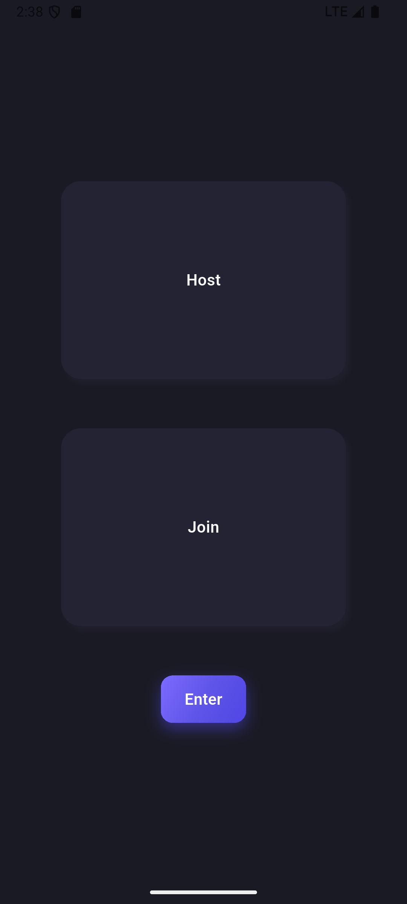
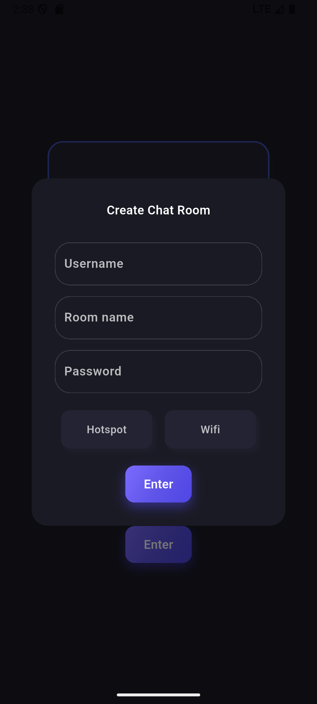
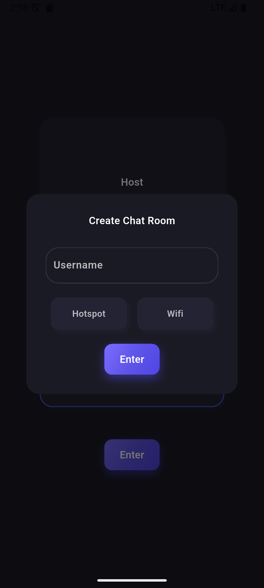

# P2P Chat App (Flutter)

A **peer-to-peer chat application** built with Flutter, enabling real-time communication over a local network without any central server.  
The app supports host/client roles, local discovery, and direct TCP communication, making it fully decentralized.

---

## 🚀 Features

- Peer-to-peer architecture (no backend server)
- 🌐 Local network discovery using UDP
- 💬 Real-time chat over TCP sockets
- 🧑‍💻 Host & Client modes
- 🔐 Optional room password
- 📱 Custom reusable UI components
- 🧠 Provider-based state management
- 🧩 Clean separation between UI, logic, and networking layers

---

## 🛠 Tech Stack

- **Flutter** (Dart)  
- TCP & UDP Sockets  
- Provider for state management  
- Custom Widgets & Dialogs  
- Material Design  

---

## 🧠 Architecture Overview

<pre>
lib/
├── chat_service/     # Networking logic (TCP / UDP)
├── data_models/      # Message, Room, User models
├── provider/         # App state management
├── ui/
│   ├── screens       # Main application screens
│   ├── dialogs       # Custom dialogs
│   └── shared        # Reusable UI components
└── interfaces/       # Abstractions for chat types
</pre>

- **Networking layer** handles socket communication  
- **Provider layer** manages app state  
- **UI layer** reacts to state changes only  
- **Interfaces** allow extensibility between host/client roles  

---

## 📡 How It Works

1. A user selects **Host** or **Client**  
2. Hosts create a room and broadcast availability via UDP  
3. Clients discover rooms on the local network  
4. TCP sockets are used for real-time messaging  
5. Messages are distributed directly between peers  

---

## 📸 Screenshots

  
  
  
  
  
  

---
